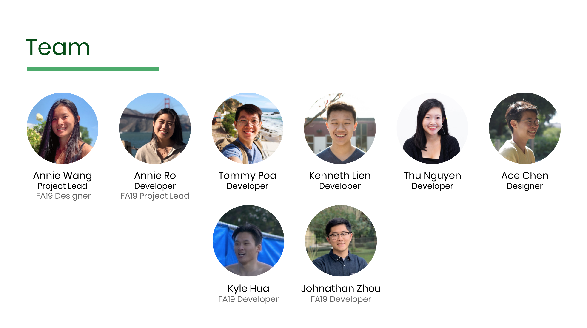

---

A guide to the customer and companion clerk applications developed with Expo, React Native, and Airtable built for DC Central Kitchen's ["Healthy Corners" initiative](https://dccentralkitchen.org/healthy-corners/).

## Introduction

- [Fall 2019 Project Presentation](https://docs.google.com/presentation/d/1Q5_InElKnsrxvVdGdSQnlQo9-2z041UiefY3XZN8qhc/edit?usp=sharing)
  - Learn about the project background and the motivation behind the application design
- [Spring 2020 Project Presentation](https://docs.google.com/presentation/d/1c3pYATagMPXHsOCdEdmAfON6V6Vqg8KVUIMyGI1Baj4/edit?usp=sharing)
  - Our final presentation - see the built-out UI at the time of the initial launch and learn about some of our big takeaways while working on this project

This project's main goal was to improve/build off Healthy Corner’s existing programs, and help customers access relevant information easily. To do so, we built a **rewards program** for customers shopping at Healthy Corner stores.

Concretely, that means we built two separate applications - one is the customer-facing mobile application, and the other is a companion Clerk application for tablets.

::: tip HOW IT WORKS
The reward process works in three steps: shop, earn, and save. Customers start by going to a participating store and buying Healthy Corners’ fresh fruits and vegetables.

For each dollar they spend on these products, they earn 100 points. Once a customer reaches 500 points, they unlock a \$5 reward, which they can redeem on more healthy products.

_In short, customers get $5 of free produce for every \$5 they spend._
:::

The core features of the **customer app** are rewards and the map screen (where store and product information are easily accessible). Late in development and in light of COVID's impact on Healthy Corners customers, we also added the Resources screen which contains categorized links to and descriptions of online resources for users. Creating an account via the mobile application registers customers as participants in our rewards program.

The **clerk application** is designed to be use in conjunction with an existing POS system at checkout. With the tablet application, clerks can log in to their accounts, look up customers, and create transactions where customers can earn points towards rewards when they buy Healthy Corners products.

**Admins** should learn to work with Airtable to ensure up-to-date information for the application(s). Since products displayed in the customer application must have been delivered recently, we've set up a scheduled product update using delivery data from Google Sheets to update Airtable. We've put together a [guide for admins](./admin) to help you get started!

**Developers** should start with the [project overview in the developer documentation](./shared/overview).

## Editing this site

This site is powered by [VuePress](https://vuepress.vuejs.org/), using the default theme with some slight styling modifications. The Markdown sources live in our [main Github repo](https://github.com/calblueprint/dccentralkitchen) on the `docs` branch in the [`docs` folder](https://github.com/calblueprint/dccentralkitchen/tree/docs/docs).

Run `yarn docs:dev` to get the documentation site running locally. It'll default to `localhost:8080`; terminal output will tell you what port if not.

### VuePress advanced usage

[Customizing the default theme and other tips](https://vuepressbook.com/)

[Reusable Markdown pseudo-components](https://github.com/vuejs/vuepress/issues/222)

- Non-ideal only in that the embedded markdown pages no longer render headers in the sidebar - for pages where headers are important, create a new section in the sidebar and link to them.

## Deployment

We use Netlify for continuous deployment. It's configured to auto-build and deploy to <https://healthycorners-rewards.netlify.app/> whenever a commit is pushed to the `dccentralkitchen/docs` branch.

## About

This project was built by one of [UC Berkeley @calblueprint](https://calblueprint.org)'s teams during the 2019-2020 school year.

