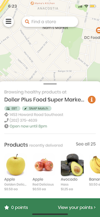

# Scheduled Updates

We run a daily job to automatically update a store's current products in Airtable from the most recent deliveries. Currently, the Google sheet that is being used to update Airtable is called `Blueprint - Store Products` on the "FY20 Sales Data and Trends" Google Sheet. It pulls data from the 'Auto Import' sheet, so it relies on the columns being as expected.

**_In general, this should not need much maintenance - only rarely, when the Google Sheet source for the delivery data changes._** _We recommend reading through this guide to understand how it works at a high level so you will be informed when action does need to be taken_.

::: danger
When the Google Sheet for deliveries is changed, the code for the automatic update **must be updated** to link to the new Google Sheet. We recommend that a developer helps do this - though it's not many steps, it does need some technical knowledge. On the admin side, the current `Blueprint - Store Products` sheet must be replicated **exactly** in the new Google Sheet, including which columns correspond to what. The formulas must be updated so that data is accurately transferred to the `Blueprint - Store Products` sheet.
:::

We'll explain the various formulas and constraints on the cells in this sheet.

---

### Header row

Most of the important cells have notes added to explain what they do as indicated by the black triangle in the upper-right corner of the cell - hover over them to view the notes.

For example, the "'Auto Import' Row LOWER Limit cell" is purely informative and doesn't affect anything else on the sheet.

The "Date Range Start" and "Date Range End" cells are used in the formulas (more on that later) and are updated during the scheduled job to be `Today` and `Today - <Date Range Length>`. Modifying these will **not** affect future scheduled updates, since the code will simply overwrite these values.

Notably, the "Date Range Length" cell is the **only cell that is used as input** by the scheduled product update code. This number indicates how many days of deliveries to check for products!

::: tip
For example, if you want to show the past 10 days of delivered products, you should update this value to **10**. The next time the scheduled job runs, it will use "10" to update the "Date Range Start" and "Date Range End" cell values.

Please note that this will only affect **future** jobs - you may need to wait up to 24 hours for this change to be reflected in the app. If you'd like it to be done faster, please have a developer run the job manually ([documentation for this app](../node)).
:::

### Formula cells

All of the yellow-highlighted cells other than "Date Range Start" and "Date Range End" are **formula cells**.

For example, the first cell in the "Store Name" is actually a formula that does a lookup to get all the names of all stores that had deliveries during the date range specified.

In general, these **do not need to be modified**.

However, for every store that has deliveries, its corresponding cells in columns **B** ("Last Delivery") and **C** ("Products") are also formula cells. This means that the formula must be manually copied in. Currently, we assume a limit of **100 stores**. That means the formulas are pre-populated up to the 101th cell.
::: danger
If there are ever > 100 stores delivered to within "Date Range Length", unless the formulas are manually copied to the 101th+ row, **some products will not be updated in Airtable.**
:::

Some additional notes about the formula cells:

- "Last Delivery" displays the latest delivery date to a store within the specified date range. However, that doesn't mean **all updated products** were delivered on that day (i.e consider the case store had multiple deliveries within the specified date range).
- All formulas use a lower bound of 21000 as the first row to start getting data from in 'Auto Import'. Theoretically, updating this lower bound in all the formulas would make the formula lookup faster, but speed shouldn't be a big problem.
- All formulas will automatically use the last row of the spreadsheet as the upper bound. This is due to A1 notation: `$A$21000:A` means start at the 21000th row and go til the end.

Example of an updated Airtable Store record

Note that Airtable keeps a record of revision history, so you can see that the latest delivery to "Dollar Plus Super Market (Howard Road)" must have been two days ago (at time of writing).

::: warning Note
Even though the scheduled update will happen daily, Airtable will only apply new updates to a store record.
:::

If you scroll down, you can see the linked Product records and can add/remove to this list as usual if you need to.

Finally, as a reminder, these are some of the affected views in the customer application. We're looking at the same example store here, so you can see that the changes are reflected directly in the application.
| Map view | Individual store's product list |
| :----------------------------------------------------: | :----------------------------------------------------------------------: |
|  |  |
