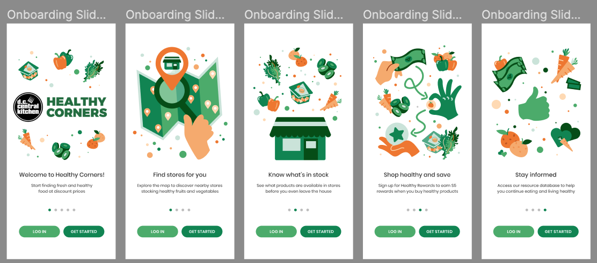

# Authentication
This document covers the main components of the customer authentication flow, including Onboarding, Sign Up, Log In, Password Reset, SMS Verification, and Guest mode.
[[toc]]

## Auth Screens
This section runs through the user flow of the Customer Auth stack, and will touch on all the different screens and possible ways to modify them.

::: tip
Read [React Navigation 5](./navigation.md) for a detailed overview of what a stack is, and the different stacks that exists within the app.
:::

Flow Diagram Taken from [React Navigation 5 Documentation](./navigation.md)

The current screens that exists in the Customer Auth stack are:
- `OnboardingScreen`
- `WelcomeScreen`
- `SignUpScreen`
- `LogInScreen`
- `PasswordResetScreen`

### `OnboardingScreen`

- A screen that shows a carousel of important information summarizing what the application does
- There are two buttons brings the user to different pages
    - **Log In** – brings the user to the `LogInScreen`. For users who already have an account to immediately log in.
    - **Get Started** – brings the user to the `WelcomeScreen`, which is further described below.

#### Modifying the onboarding content

- Navigate to the file `constants/Onboarding.js`, which contains all the content (text and illustration) of the different screens

### `WelcomeScreen`

- Screen that shows three available buttons
    - Log In – brings the user to the `LogInScreen`.
    - Sign Up – brings the user to the `SignUpScreen`.
    - **Continue without an account** – allows user to immediately use the App as a Guest.
### `SignUpScreen`

- Screen for user to input their information to sign up for an account.

### `LogInScreen`

- Screen to allow existing users to log in.
- For users who forgot their password, there is a **Forgot password?** button that brings the user to the `PasswordResetScreen`

### `PasswordResetScreen`

- Screen that brings the user through the flow of resetting the password

## Adding a new screen

- Create a new screen file in the `screens/auth` folder
- Add the screen to the `navigation/stack_navigators/AuthStack.js` file

## SMS Verification

Phone authentication is handled using Google Firebase through Expo, and imported as `expo-firebase-recaptcha`.

It is used on: 
- `SignUpScreen`
- `LogInScreen`
- `VerificationScreen`
- `PasswordResetScreen`

### Workflow
#### Signing Up
Clicking Create Account triggers the reCaptcha modal (provided by imports) to pop up. Upon successful anti-robot verification, setModalVisible is called to pull up `VerificationScreen`. This prompts the user to enter the verification code. On successful entry, the modal calls functions that have been passed in to complete account creation.

#### Forgot Password
Pressing forgot password prompts the user to enter their phone number, which if successful, triggers the reCaptcha modal (provided by imports) to pop up. Upon successful anti-robot verification, setModalVisible is called to pull up `VerificationScreen`. This prompts the user to enter the verification code. On successful entry, the modal calls functions that have been passed in to allow new passwords to be created.

#### Relevant PRs
- [Customer #97: Phone Number Authentication + Forgot Password Functionality](https://github.com/calblueprint/dccentralkitchen/pull/97)
#### Helpful links
- <https://expo.canny.io/feature-requests/p/phone-number-auth-with-firebase>
  

## Guest mode
Guest Mode allows users to access non-rewards features of the app without the need for an account.

Guest Mode relies on a dummy account on Airtable with the number ########## so that no one can intentionally log in as a guest.

::: warning
This Guest record must not be deleted from the Customers table or the record ID will not match.
:::

Throughout the app, the guest id is stored as a constant and used to check if the user is currently signed in as a guest. If so, the entirety of the rewards features are turned to pointers to create an account, but the user still retains access to [resources](resources.md), [settings](settings.md), and the ability to search and filter stores.

See [Customer PR #74: Guest Mode](https://github.com/calblueprint/dccentralkitchen/pull/74)
