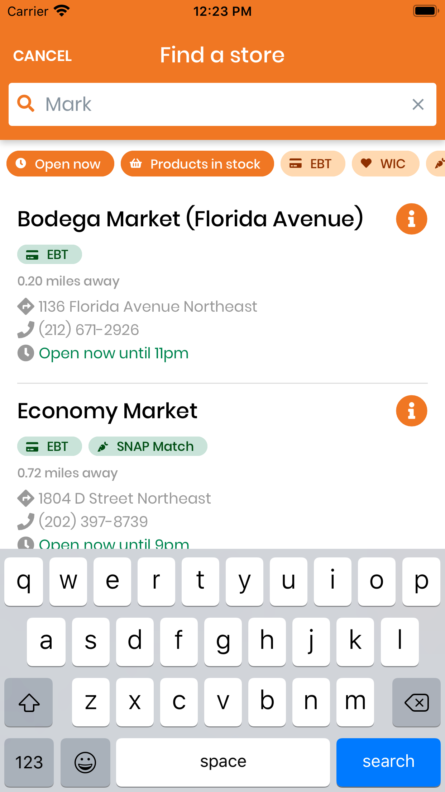
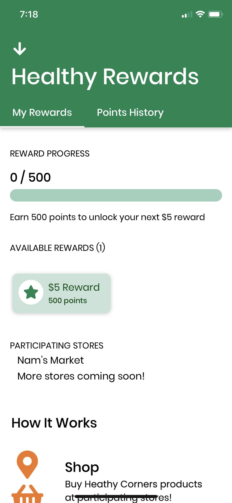
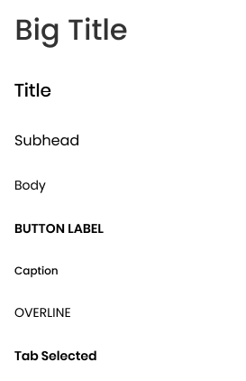

<!-- Embedded with the <Content/> Vue component into Customer/Clerk sections -->

::: warning NOTE
This documentation is the same for both the customer and clerk applications.
:::

[[toc]]

::: tip Design prototypes
See the design prototypes in Figma [here](../design.md#shared-components)
:::

## Base Components

If you find yourself adding something that is used throughout the application (e.g. a new styled button) rather than having it confined to one screen or one location, consider making it into a base component as to reduce repetitive code/importing from different locations.

[Customer PR #28: Base Components](https://github.com/calblueprint/dccentralkitchen/pull/28)

### Buttons

- `TextButton`: Used as a base of other button labels
- `ButtonLabel`: Used to add text to button containers
- `ButtonContainer`: A sized TouchableOpacity

  ```jsx
  // Source: WelcomeScreen.js
  <ButtonContainer onPress={async () => this.guestLogin()}>
    <ButtonLabel style={{ textTransform: 'none' }} color={Colors.primaryGreen}>
      Continue without an account
    </ButtonLabel>
  </ButtonContainer>
  ```

- `FilledButtonContainer`: Rounded button that is green by default, but color props and rounding can be passed in.

  ```jsx
  <FilledButtonContainer
    color={Colors.lighterGreen}
    width="100%"
    onPress={() => this.navigateLogIn()}>
    <ButtonLabel color={Colors.lightest}>Log In</ButtonLabel>
  </FilledButtonContainer>
  ```

- `SquareButtonContainer` (**clerk app only**): is a 54px by 54px square button

  ```jsx
  // + button in RewardModal.js
  <SquareButtonContainer
    activeOpacity={max ? 1 : 0.2}
    color={max ? Colors.lightestGreen : Colors.darkerGreen}
    onPress={() =>
      max ? this.showError(true) : this.updateRewardsApplied(true)
    }>
    <BigTitleLabel>+</BigTitleLabel>
  </SquareButtonContainer>
  ```

## Navigation Headers

::: warning NOTE
Navigation headers are only used in the customer app.
:::

All navigation headers use a `NavHeaderContainer`, but the `NavButton` and `NavTitle` are optional. The `NavHeaderContainer` can contain other components (see [Store List Example](#store-list-vertical-nav-header-containing-other-components))

### `NavButton`

Used as navigation buttons, seen as the back buttons and hamburger button throughout the app.

### `NavHeaderContainer`

Container with shadows for most screens. For example, rewards and resources use differently styled headers which is created by passing in the background color, margin, height, and shadow for the header.

#### Props

| Name            | Type    | Description                                                                                                                             |
| --------------- | ------- | --------------------------------------------------------------------------------------------------------------------------------------- |
| backgroundColor | string  | The background color of the header container. Defaults to `Colors.lightest` which is `#ffffff` white.                                   |
| withMargin      | boolean | If true, the header container will have a 16px bottom margin.<br><br>Defaults to false so content after will be flush to the container. |
| vertical        | boolean | If false, the header will expand vertically to accommodate content.<br><br>Defaults to false for a horizontal flex direction.           |
| noShadow        | boolean | If true, the header container will not have any drop shadow.<br><br>Defaults to false to include a drop shadow.                         |

### `NavTitle`

Specially styled `Title` for headers with centered text and appropriate spacing.

#### Props

| Name  | Type   | Description                                                         |
| ----- | ------ | ------------------------------------------------------------------- |
| color | string | Text color of the navigation title. Defaults to `Colors.activeText` |

### Usage Examples

#### Store Details: Standard usage

```jsx
// Source: StoreDetailsScreen.js
import { FontAwesome5 } from '@expo/vector-icons';
import { NavButton, NavHeaderContainer, NavTitle } from '../../components/BaseComponents';
...
<NavHeaderContainer>
    <NavButton onPress={() => this.props.navigation.goBack()}>
        <FontAwesome5 name="arrow-left" solid size={24} />
    </NavButton>
    <NavTitle>{storeName}</NavTitle>
</NavHeaderContainer>
```

::: details Result

:::

#### Store List: Vertical nav header containing other components

```jsx
// Source: StoreListScreen.js
<NavHeaderContainer vertical backgroundColor={Colors.primaryOrange}>
    <ColumnContainer style={{ width: '100%' }}>
        <RowContainer
            style={{
            width: '100%',
            alignItems: 'center',
            justifyContent: 'center',
            }}>
            <CancelButton onPress={() => this.props.navigation.goBack()}>
                <ButtonLabel color={Colors.lightest}>Cancel</ButtonLabel>
            </CancelButton>
            <Title color={Colors.lightest} style={{ textAlign: 'center' }}>Find a store</Title>
        </RowContainer>
        <SearchBar
            ...
        />
    </ColumnContainer>
</NavHeaderContainer>
```

::: details Result

:::

#### RewardsScreen: Vertical nav header with a custom text style

```jsx
// Source: RewardsScreen.js
<NavHeaderContainer vertical noShadow backgroundColor={Colors.primaryGreen}>
  <NavButton onPress={() => this.props.navigation.goBack()}>
    <FontAwesome5 name="arrow-down" solid size={24} color="white" />
  </NavButton>
  <BigTitle style={{ marginLeft: 18, color: Colors.lightest, fontSize: 36 }}>
    Healthy Rewards
  </BigTitle>
</NavHeaderContainer>
```

::: details Result

:::
::: tip Using SafeAreaProvider for notch detection
The header container detects safe area insets and adjusts the navigation heading height depending on if the device has a notch.

In order to use `SafeAreaProvider` to detect if the device has a notch:

- NavHeaderContainer must be a functional component
- The root component must be wrapped in SafeAreaProvider

[See Expo SafeAreaContext docs here](https://docs.expo.io/versions/latest/sdk/safe-area-context/)

[Related PR: #56](https://github.com/calblueprint/dccentralkitchen/pull/56)

In the `NavHeaderContainer`, the `topInset` is calculated with `useSafeArea().top`, and this inset is added to the top padding to make sure the heading content is not blocked by a notch if the device has a notch.

```jsx
// Source: BaseComponents.js
import { useSafeArea } from 'react-native-safe-area-context';
...
export function NavHeaderContainer({
    ...
}) {
  const topInset = useSafeArea().top;
  return (
    <View
      style={{
        ...
        paddingTop: 16 + topInset,
        minHeight: 62 + topInset,
        ...
      }}>
      {children}
    </View>
  );
}
```

:::

## Text Components

The following text components from `BaseComponents.js` are used throughout both apps.

- `BigTitle`
- `Title`
- `Subhead`
- `Body`
- `Caption`
- `Overline`
- `TabSelected`

This is how the text components are displayed. Source: [component designs in Figma](../design.md#shared-components).



## Colors

Various colors used throughout the app have been defined in `Colors.js`

<<< @/constants/Colors.js


## `shared.js` Containers

`shared.js` contains a variety of styled containers to format components. For simplicity, the names are intuitive. There are the following:

- `RowContainer`
- `ColumnContainer`
- `InLineContainer`
- `SpaceBetweenRowContainer`
- `SpaceBetweenColumnContainer`
- `SpaceAroundRowContainer`
- `JustifyCenterContainer`

We can see things like `JustifyCenterContainer` used to center buttons on screens such as `SignUpScreen.js.`Use shared/ to find components to format.

## When to create a base component/shared component

If you find yourself using a fairly styled component throughout the app (say, a fun looking button!), you should make it a base component to reduce redundant code.

If you're trying to align components in a fun way, check `shared.js` first, and if it's not there, add a container so that it can be reused in the future!

## Styling considerations for Android

We have run into a few issues that only appear on Android devices:

- Android does not register `box-shadow`. Instead, you have to use `elevation`.
- `font-weight` cannot be specified in CSS for custom fonts,or it will default to Android in Roboto ([source](https://github.com/react-navigation/react-navigation/issues/2822)). However, you must specify `fontWeight: 'normal'` in `createDrawerNavigator`
- To make passwords hide in text fields on Android, the `keyboardType` must be set to `undefined`

### Android bugfix PRs

- [#78](https://github.com/calblueprint/dccentralkitchen/pull/78/)
- [#121](https://github.com/calblueprint/dccentralkitchen/pull/121)
- [#152](https://github.com/calblueprint/dccentralkitchen/pull/152)
